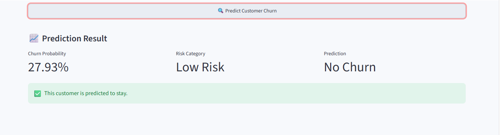

# 📊 Telecom Customer Churn Prediction

A machine learning project that predicts whether a telecom customer is likely to churn and provides a churn probability through an interactive Streamlit web application.

## 🚀 Project Overview

Customer churn occurs when a customer stops using a company's services.

In the telecom industry, identifying customers who are likely to leave can help businesses take preventive retention actions.

This project analyzes customer demographics, services, contract information, payment methods, tenure, and billing information to identify patterns associated with churn.

A machine learning model is then trained to predict customer churn.

---

## 🎯 Objectives

- Analyze the major factors associated with customer churn.
- Perform exploratory data analysis on telecom customer data.
- Prepare and preprocess data for machine learning.
- Compare multiple classification models.
- Handle class imbalance using class-weighted Logistic Regression.
- Evaluate the model using accuracy, precision, recall, F1-score, and ROC-AUC.
- Deploy the trained model using Streamlit.

---

## 📂 Dataset

The project uses the **Telco Customer Churn** dataset.

The dataset contains information about:

- Customer demographics
- Tenure
- Contract type
- Internet service
- Online security
- Online backup
- Device protection
- Technical support
- Streaming services
- Payment method
- Paperless billing
- Monthly charges
- Total charges
- Customer churn status

The target variable is:

```text
Churn
0 = No Churn
1 = Churn 
---

## 🔎 Exploratory Data Analysis

Several variables were analyzed to understand their relationship with churn.

### Contract Type

Month-to-month customers showed a significantly higher churn rate than customers with one-year and two-year contracts.

| Contract | Churn Rate |
|---|---:|
| Month-to-month | 42.71% |
| One year | 11.27% |
| Two year | 2.83% |

### Internet Service

Fiber optic customers showed a considerably higher churn rate than DSL and customers without internet service.

| Internet Service | Churn Rate |
|---|---:|
| DSL | 18.96% |
| Fiber optic | 41.89% |
| No Internet | 7.40% |

### Payment Method

Electronic check customers showed the highest churn rate among the payment methods analyzed.

| Payment Method | Churn Rate |
|---|---:|
| Bank transfer (automatic) | 16.71% |
| Credit card (automatic) | 15.24% |
| Electronic check | 45.29% |
| Mailed check | 19.11% |

### Other Observations

Additional analysis showed:

Newer customers generally had higher churn.
Customers with online security had lower observed churn than customers without it.
Customers without technical support showed higher churn.
Senior citizens showed a higher churn rate than non-senior customers.
Customers with paperless billing showed higher observed churn.
Customers without partners/dependents showed higher observed churn.

These findings describe associations in the dataset and should not be interpreted as proof of causation.

 ## 🛠️ Data Preprocessing

The following preprocessing steps were performed:

Converted TotalCharges to numeric.
Handled 11 missing TotalCharges values associated with zero-tenure customers by assigning them a value of 0.
Removed customerID because it is an identifier rather than a useful predictive feature.
Converted the target variable:
No → 0
Yes → 1
Applied one-hot encoding to categorical variables.
Split the dataset into training and testing sets using an 80/20 split.
Used stratification to preserve the churn-class distribution.
Standardized the feature values for Logistic Regression.

## 🤖 Machine Learning Models

Three classification approaches were evaluated:

Logistic Regression
Decision Tree
Random Forest

The initial Logistic Regression model performed better than the default Decision Tree and Random Forest on the main evaluation metrics.

Because the dataset contains fewer churned customers than non-churned customers, a class-weighted Logistic Regression model was also trained.

## ⚖️ Class Imbalance Handling

The original target distribution was:

No Churn: 5,174 customers
Churn: 1,869 customers

To improve the model's ability to identify churned customers, class_weight="balanced" was used with Logistic Regression.

This substantially increased recall for the churn class.

## 🏆 Final Model

The final model selected for the project is:

Balanced Logistic Regression

### Final Performance

| Metric | Score |
|---|---:|
| Accuracy | 74.02% |
| Precision | 50.69% |
| Recall | 78.61% |
| F1 Score | 61.64% |
| ROC-AUC | 84.14% |
## Why Balanced Logistic Regression?

The main goal of this project is to identify customers who may churn.

The balanced Logistic Regression model achieved:

78.61% recall for churned customers

This means the model identifies a large proportion of customers who actually churn, although it also produces some false positives.

The ROC-AUC of 84.14% indicates good overall discrimination between churn and non-churn customers.

## 📊 Final Confusion Matrix

Using the selected threshold of 0.5:

```text
                    Predicted
                  No Churn   Churn

Actual No Churn      749      286
Actual Churn          80      294

The model correctly identified 294 churned customers while missing 80 actual churners in the test set.

## 🔍 Important Model Features

The Logistic Regression model identified several influential features.

Some of the strongest model coefficients included:

Tenure
Monthly Charges
Fiber optic internet service
Two-year contract
Total Charges
One-year contract
Streaming Movies
Streaming TV
Electronic check payment method
Paperless billing

Model coefficients represent associations learned by the model and should not be interpreted as causal effects.

## 🌐 Streamlit Application

The trained model has been deployed using Streamlit.

### 📸 Application Preview


🚀 **Live Demo:** [Customer Churn Prediction App](https://customer-churn-prediction-h3qdjzdn4cmgpql7hgwgrg.streamlit.app/)

The application allows users to enter customer information such as:

Demographics
Tenure
Contract type
Internet service
Online security
Technical support
Payment method
Monthly charges
Total charges

The application returns:

Churn probability
Risk category
Churn / No Churn prediction
### Risk Categories

| Churn Probability | Risk |
|---|---|
| < 30% | Low Risk |
| 30%–60% | Medium Risk |
| ≥ 60% | High Risk |

These risk categories are presentation thresholds used by this project and are not statistically validated business thresholds.

## 🧰 Technologies Used
Python
Pandas
NumPy
Matplotlib
Scikit-learn
Joblib
Streamlit
Jupyter Notebook

## 📁 Project Structure
customer_churn_prediction/
│
├── app.py
├── data.csv
├── Customer_Churn_Prediction.ipynb
│
├── churn_model.pkl
├── churn_scaler.pkl
├── churn_features.pkl
├── model_info.pkl
│
├── requirements.txt
├── README.md
└── .gitignore
▶️ How to Run the Project
1. Clone the repository
git clone https://github.com/kashish77-gif/customer-churn-prediction.git
cd customer-churn-prediction
2. Navigate to the project folder
cd customer_churn_prediction
3. Install dependencies
pip install -r requirements.txt
4. Run the Streamlit application
streamlit run app.py

The application will open in your browser.

## 🔮 Future Improvements

Possible future improvements include:

Hyperparameter tuning
Cross-validation-based model comparison
Better probability calibration
Feature engineering
Explainable AI techniques such as SHAP
Automated retention recommendations
Cloud deployment
Monitoring model performance after deployment
## 👩‍💻 Author
Kashish Vashishta

Computer Science Engineering Student

Interested in:

Data Science
Machine Learning
Artificial Intelligence
Data Analytics
## ⭐ Project Highlight

This project demonstrates an end-to-end machine learning workflow:

Raw Data
   ↓
Data Cleaning
   ↓
Exploratory Data Analysis
   ↓
Feature Engineering & Encoding
   ↓
Train/Test Split
   ↓
Model Training
   ↓
Class Imbalance Handling
   ↓
Model Evaluation
   ↓
Model Saving
   ↓
Streamlit Deployment

Save it
Press:
**Ctrl + S**


